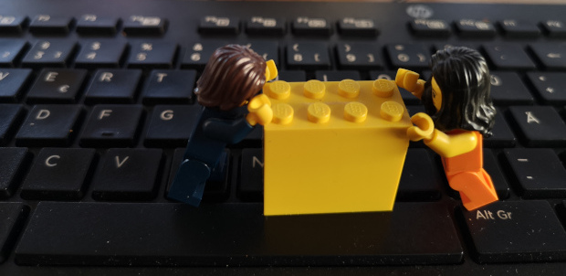
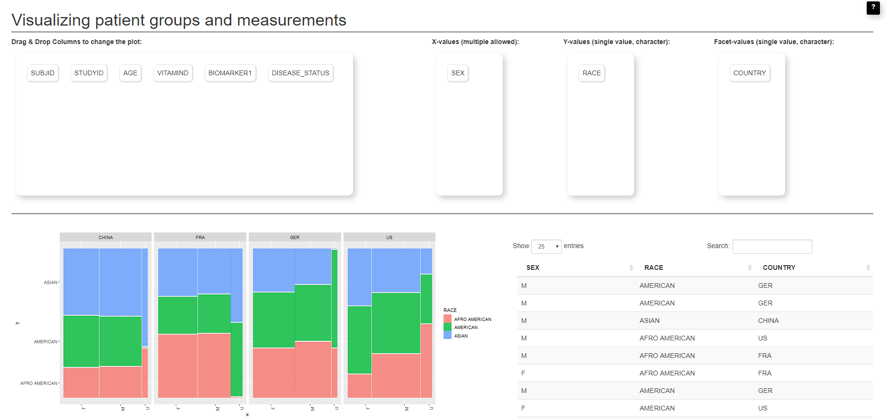

# RSelenium or shinytest

*How to make shiny apps ready for use in a regulated environment*


---

Presentation [@EARLconf](https://earlconf.com) on September 12 2019

The code inside this repository contains the following folders with examples

- **shinytest**: An app for Diagnostics quality control and a test case ran by the [shinytest](https://github.com/rstudio/shinytest)-package.
- **RSelenium**: An app for a Pharma study validation report, that is tested with either pure [RSelenium](https://github.com/ropensci/RSelenium)-package or *RSeleniumTest*.
- **pptx**: The slides presented [@EARLconf](https://earlconf.com).
- **balsamique**: Balsamique files to plan the apps to be tested.

### Before looking into the code

Install all dependencies:

```
install.packages(c("shinytest", "tidyverse", "shiny", "XML", "jsonlite", "ggplot2", "ggmosaic", "callr"))
```

## shinytest


## RSelenium

### Setup

For my setup I downloaded the [ChromeDriver](https://sites.google.com/a/chromium.org/chromedriver/downloads) and [GheckoDriver](https://github.com/mozilla/geckodriver/releases) for Selenium. Additionally
you will need the [SeleniumServer-Standalone](https://bit.ly/2TlkRyu).

On my PC
I stored them under: `C:\Programme_2\RSelenium`. You will see this address a lot
of times in the code. If you want an easy way of working, I recommend storing your
code there, too.

You will need Java > v8 to run Selenium.

### The App

The app showing Pharma data shall be used for stakeholders
checking clinical studies.



 Inside the Pharma App we build a drag&drop to allow users to define what they want to plot. The plot shall be tested by image comparison.

As this app is for non-statisticians, there is also a help build in which shall be tested. Even if here, the help does not contain anything.

Moreover a data-table should ensure that data is not changed form input to output.

App parts:

- Drag and drop for variables
- Opens pop-up with on hover on help
- hidden input value
- Data table
- should run on multiple sites (asia Chrome / Europe Firefox)

### Files

`app.R`

Contains the app Code itself. You can simply run the app and play
around by opening it in RStudio. It is recommended to run the
app in Chrome or Firefox.

`test.app.R`

Starts the app via `callr` in a second session. Starts a Selenium Standalone
server, runs a clicktests in Firefox, stops the app and the Selenium Server.

`test.app.RSeleniumTest.R`

This script just runs on my computer. For disclosure reasons the package
`RSeleniumTest` is not open-sourced, yet. But RSeleniumTest uses the
two XML files `TC-RSelenium-MicroTest-chrome.xml` and `TC-RSelenium-MicroTest-firefox.xml` to test the app.

